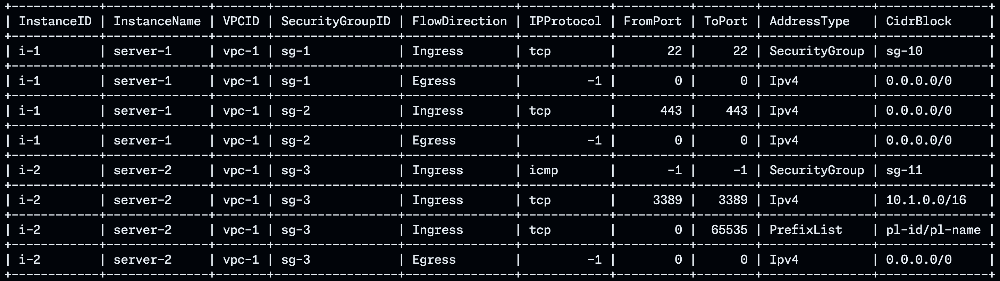
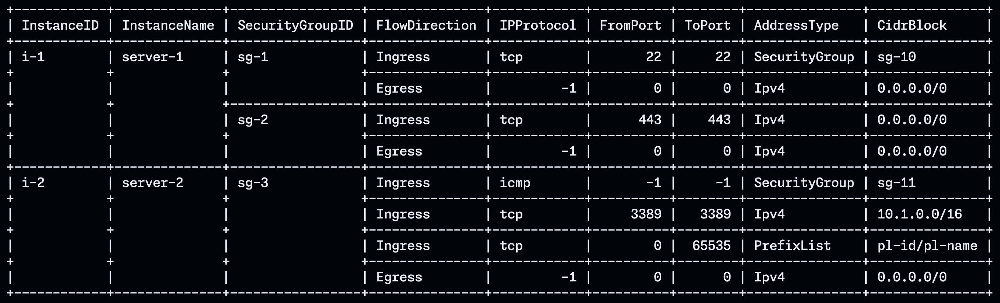
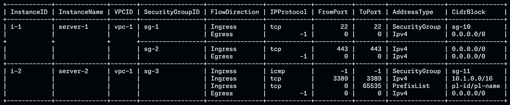
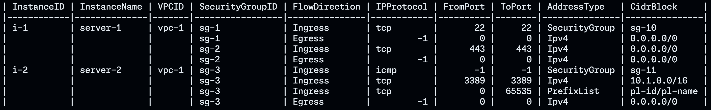
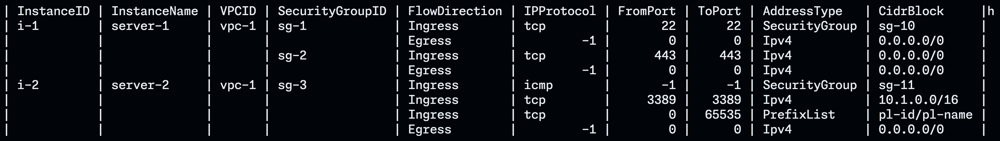

mintab
======

[](https://github.com/nekrassov01/mintab/actions/workflows/test.yml)
[](https://codecov.io/gh/nekrassov01/mintab)
[](https://pkg.go.dev/github.com/nekrassov01/mintab)
[](https://goreportcard.com/report/github.com/nekrassov01/mintab)

mintab is a minimum ASCII table utilities written in Go

Motivation
----------

While [tablewriter](https://github.com/olekukonko/tablewriter) is useful, I wanted a smaller package with features such as backlog format support that tablewriter does not have.

Format
------

Text



Text merged



Compressed-text merged



Markdown merged



Backlog merged



Support
-------

- Text table format
- Markdown table format
- Backlog table format
- Group rows based on previous field value
- Ignore specified columns
- Escape HTML special characters
- Set multiple values to a field as a joined string
- Set byte slices as a string

Notes
-----

- Only non-nested struct slices are accepted
- Using reflect

Usage
-----

[Example](example_test.go)

Benchmark
---------

[A quick benchmark](benchmark.go)

This is only for reference as the functions are different, but for simple drawing, it has better performance than TableWriter.

```text
go test -run=^$ -bench=. -benchmem -count 5
goos: darwin
goarch: arm64
pkg: github.com/nekrassov01/mintab
BenchmarkMintab-8                  41235             28038 ns/op           20526 B/op        399 allocs/op
BenchmarkMintab-8                  41691             28760 ns/op           20526 B/op        399 allocs/op
BenchmarkMintab-8                  42501             28221 ns/op           20527 B/op        399 allocs/op
BenchmarkMintab-8                  42108             28884 ns/op           20527 B/op        399 allocs/op
BenchmarkMintab-8                  41623             28025 ns/op           20527 B/op        399 allocs/op
BenchmarkMintabSimple-8            53133             21718 ns/op           13033 B/op        242 allocs/op
BenchmarkMintabSimple-8            55862             21989 ns/op           13033 B/op        242 allocs/op
BenchmarkMintabSimple-8            52072             21951 ns/op           13033 B/op        242 allocs/op
BenchmarkMintabSimple-8            49274             25767 ns/op           13033 B/op        242 allocs/op
BenchmarkMintabSimple-8            56613             20016 ns/op           13033 B/op        242 allocs/op
BenchmarkTableWriter-8             24984             48162 ns/op           25336 B/op        701 allocs/op
BenchmarkTableWriter-8             25264             48327 ns/op           25347 B/op        701 allocs/op
BenchmarkTableWriter-8             24562             53952 ns/op           25398 B/op        701 allocs/op
BenchmarkTableWriter-8             25231             48222 ns/op           25371 B/op        701 allocs/op
BenchmarkTableWriter-8             23983             51700 ns/op           25359 B/op        701 allocs/op
PASS
ok      github.com/nekrassov01/mintab   23.596s
```

Author
------

[nekrassov01](https://github.com/nekrassov01)

License
-------

[MIT](https://github.com/nekrassov01/mintab/blob/main/LICENSE)
