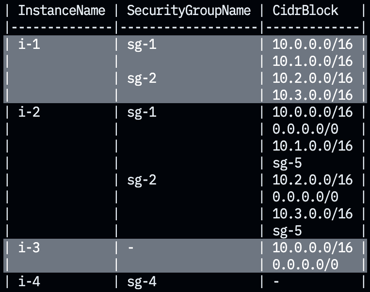

mintab
======

[](https://github.com/nekrassov01/mintab/actions/workflows/test.yml)
[](https://codecov.io/gh/nekrassov01/mintab)
[](https://pkg.go.dev/github.com/nekrassov01/mintab)
[](https://goreportcard.com/report/github.com/nekrassov01/mintab)

mintab is a minimum ASCII table utilities using [tablewriter](https://github.com/olekukonko/tablewriter)



Support
-------

- Markdown table format
- Backlog table format
- Group rows based on previous field value
- Color rows based on first column value
- Ignore specified columns

Notes
-----

- Only non-nested struct slices are accepted (but byte slices are converted to strings)
- Using reflect

Usage
-----

```go
func main() {
	type sample struct {
		InstanceName      string
		SecurityGroupName string
		CidrBlock         []string
	}

	samples := []sample{
		{InstanceName: "i-1", SecurityGroupName: "sg-1", CidrBlock: []string{"10.0.0.0/16"}},
		{InstanceName: "i-1", SecurityGroupName: "sg-1", CidrBlock: []string{"10.1.0.0/16"}},
		{InstanceName: "i-1", SecurityGroupName: "sg-2", CidrBlock: []string{"10.2.0.0/16"}},
		{InstanceName: "i-1", SecurityGroupName: "sg-2", CidrBlock: []string{"10.3.0.0/16"}},
		{InstanceName: "i-2", SecurityGroupName: "sg-1", CidrBlock: []string{"10.0.0.0/16", "0.0.0.0/0"}},
		{InstanceName: "i-2", SecurityGroupName: "sg-1", CidrBlock: []string{"10.1.0.0/16", "0.0.0.0/0"}},
		{InstanceName: "i-2", SecurityGroupName: "sg-2", CidrBlock: []string{"10.2.0.0/16", "0.0.0.0/0"}},
		{InstanceName: "i-2", SecurityGroupName: "sg-2", CidrBlock: []string{"10.3.0.0/16", "0.0.0.0/0"}},
		{InstanceName: "i-3", SecurityGroupName: "", CidrBlock: []string{"10.0.0.0/16", "0.0.0.0/0"}},
		{InstanceName: "i-4", SecurityGroupName: "sg-4", CidrBlock: []string{}},
	}

	var table *mintab.Table

	table = mintab.NewTable()
	if err := table.Load(samples); err != nil {
		log.Fatal(err)
	}
	fmt.Println(table.Out())

    /*
    | InstanceName | SecurityGroupName | CidrBlock                |
    | ------------ | ----------------- | ------------------------ |
    | i-1          | sg-1              | 10.0.0.0/16              |
    | i-1          | sg-1              | 10.1.0.0/16              |
    | i-1          | sg-2              | 10.2.0.0/16              |
    | i-1          | sg-2              | 10.3.0.0/16              |
    | i-2          | sg-1              | 10.0.0.0/16<br>0.0.0.0/0 |
    | i-2          | sg-1              | 10.1.0.0/16<br>0.0.0.0/0 |
    | i-2          | sg-2              | 10.2.0.0/16<br>0.0.0.0/0 |
    | i-2          | sg-2              | 10.3.0.0/16<br>0.0.0.0/0 |
    | i-3          | N/A               | 10.0.0.0/16<br>0.0.0.0/0 |
    | i-4          | sg-4              | N/A                      |
    */

	table = mintab.NewTable(mintab.WithFormat(mintab.BacklogFormat))
	if err := table.Load(samples); err != nil {
		log.Fatal(err)
	}
	fmt.Println(table.Out())

    /*
    | InstanceName | SecurityGroupName | CidrBlock                |h
    | i-1          | sg-1              | 10.0.0.0/16              |
    | i-1          | sg-1              | 10.1.0.0/16              |
    | i-1          | sg-2              | 10.2.0.0/16              |
    | i-1          | sg-2              | 10.3.0.0/16              |
    | i-2          | sg-1              | 10.0.0.0/16&br;0.0.0.0/0 |
    | i-2          | sg-1              | 10.1.0.0/16&br;0.0.0.0/0 |
    | i-2          | sg-2              | 10.2.0.0/16&br;0.0.0.0/0 |
    | i-2          | sg-2              | 10.3.0.0/16&br;0.0.0.0/0 |
    | i-3          | N/A               | 10.0.0.0/16&br;0.0.0.0/0 |
    | i-4          | sg-4              | N/A                      |
    */

	table = mintab.NewTable(mintab.WithHeader(false))
	if err := table.Load(samples); err != nil {
		log.Fatal(err)
	}
	fmt.Println(table.Out())

    /*
    | i-1 | sg-1 | 10.0.0.0/16              |
    | i-1 | sg-1 | 10.1.0.0/16              |
    | i-1 | sg-2 | 10.2.0.0/16              |
    | i-1 | sg-2 | 10.3.0.0/16              |
    | i-2 | sg-1 | 10.0.0.0/16<br>0.0.0.0/0 |
    | i-2 | sg-1 | 10.1.0.0/16<br>0.0.0.0/0 |
    | i-2 | sg-2 | 10.2.0.0/16<br>0.0.0.0/0 |
    | i-2 | sg-2 | 10.3.0.0/16<br>0.0.0.0/0 |
    | i-3 | N/A  | 10.0.0.0/16<br>0.0.0.0/0 |
    | i-4 | sg-4 | N/A                      |
    */

	table = mintab.NewTable(mintab.WithEmptyFieldPlaceholder("NULL"))
	if err := table.Load(samples); err != nil {
		log.Fatal(err)
	}
	fmt.Println(table.Out())

    /*
    | InstanceName | SecurityGroupName | CidrBlock                |
    | ------------ | ----------------- | ------------------------ |
    | i-1          | sg-1              | 10.0.0.0/16              |
    | i-1          | sg-1              | 10.1.0.0/16              |
    | i-1          | sg-2              | 10.2.0.0/16              |
    | i-1          | sg-2              | 10.3.0.0/16              |
    | i-2          | sg-1              | 10.0.0.0/16<br>0.0.0.0/0 |
    | i-2          | sg-1              | 10.1.0.0/16<br>0.0.0.0/0 |
    | i-2          | sg-2              | 10.2.0.0/16<br>0.0.0.0/0 |
    | i-2          | sg-2              | 10.3.0.0/16<br>0.0.0.0/0 |
    | i-3          | NULL              | 10.0.0.0/16<br>0.0.0.0/0 |
    | i-4          | sg-4              | NULL                     |
    */

	table = mintab.NewTable(mintab.WithWordDelimiter(","))
	if err := table.Load(samples); err != nil {
		log.Fatal(err)
	}
	fmt.Println(table.Out())

    /*
    | InstanceName | SecurityGroupName | CidrBlock             |
    | ------------ | ----------------- | --------------------- |
    | i-1          | sg-1              | 10.0.0.0/16           |
    | i-1          | sg-1              | 10.1.0.0/16           |
    | i-1          | sg-2              | 10.2.0.0/16           |
    | i-1          | sg-2              | 10.3.0.0/16           |
    | i-2          | sg-1              | 10.0.0.0/16,0.0.0.0/0 |
    | i-2          | sg-1              | 10.1.0.0/16,0.0.0.0/0 |
    | i-2          | sg-2              | 10.2.0.0/16,0.0.0.0/0 |
    | i-2          | sg-2              | 10.3.0.0/16,0.0.0.0/0 |
    | i-3          | N/A               | 10.0.0.0/16,0.0.0.0/0 |
    | i-4          | sg-4              | N/A                   |
    */

	table = mintab.NewTable(mintab.WithMergeFields([]int{0, 1}), mintab.WithTheme(mintab.DarkTheme))
	if err := table.Load(samples); err != nil {
		log.Fatal(err)
	}
	fmt.Println(table.Out())

    /*
    | InstanceName | SecurityGroupName | CidrBlock                |
    | ------------ | ----------------- | ------------------------ |
    | i-1          | sg-1              | 10.0.0.0/16              |
    |              |                   | 10.1.0.0/16              |
    |              | sg-2              | 10.2.0.0/16              |
    |              |                   | 10.3.0.0/16              |
    | i-2          | sg-1              | 10.0.0.0/16<br>0.0.0.0/0 |
    |              |                   | 10.1.0.0/16<br>0.0.0.0/0 |
    |              | sg-2              | 10.2.0.0/16<br>0.0.0.0/0 |
    |              |                   | 10.3.0.0/16<br>0.0.0.0/0 |
    | i-3          | N/A               | 10.0.0.0/16<br>0.0.0.0/0 |
    | i-4          | sg-4              | N/A                      |
    */

	table = mintab.NewTable(mintab.WithIgnoreFields([]int{2}))
	if err := table.Load(samples); err != nil {
		log.Fatal(err)
	}
	fmt.Println(table.Out())

    /*
    | InstanceName | SecurityGroupName |
    | ------------ | ----------------- |
    | i-1          | sg-1              |
    | i-1          | sg-1              |
    | i-1          | sg-2              |
    | i-1          | sg-2              |
    | i-2          | sg-1              |
    | i-2          | sg-1              |
    | i-2          | sg-2              |
    | i-2          | sg-2              |
    | i-3          | N/A               |
    | i-4          | sg-4              |
    */

	type escaped struct {
		Domain string
	}
	escapes := []escaped{
		{Domain: "*.example.com"},
	}

	table = mintab.NewTable(mintab.WithEscapeTargets([]string{"*"}))
	if err := table.Load(escapes); err != nil {
		log.Fatal(err)
	}
	fmt.Println(table.Out())

    /*
    | Domain         |
    | -------------- |
    | \*.example.com |
    */
}
```

Author
------

[nekrassov01](https://github.com/nekrassov01)

License
-------

[MIT](https://github.com/nekrassov01/mintab/blob/main/LICENSE)
